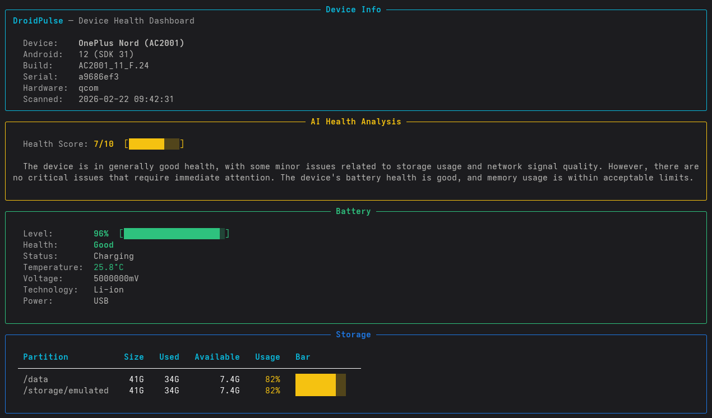

# DroidPulse 🤖💓

**AI-Powered Android Device Health Dashboard using ADB**

DroidPulse connects to Android devices via ADB, collects system health data (battery, storage, apps, network, CPU/memory), and uses Groq AI (Llama 3.3 70B) to analyze device health, flag issues, and generate actionable recommendations.

## Features

- 📱 ADB Device Discovery — auto-detect USB and WiFi-connected devices
- 🔋 Health Data Collection — battery, storage, memory, CPU, network, installed apps
- 🌐 WiFi Diagnostics — signal strength, frequency band, latency, DNS checks
- 🤖 AI-Powered Analysis — Groq AI (Llama 3.3) analyzes health data and flags issues
- 📊 Terminal Dashboard — color-coded health summary in your terminal
- 📄 HTML Reports — professional reports with health scores and recommendations
- 📡 ADB over WiFi — manage devices wirelessly
- 🔁 Multi-Device Support — scan and report on multiple devices
- ⏱️ Automation Ready — supports scheduled scans via cron or systemd timers

## Terminal Dashboard



## HTML Report


## Tech Stack

- **Python 3** — core logic, data processing, AI integration
- **Bash** — ADB command wrappers, automation scripts
- **ADB** — Android device data collection
- **Groq AI (Llama 3.3 70B)** — AI-powered health analysis
- **Rich** — terminal dashboard formatting
- **Jinja2** — HTML report templating
- **Fedora Linux** — host operating system

## Environment Setup

### Prerequisites

- Fedora Workstation (tested on Fedora 41)
- Android device with USB cable (tested on OnePlus Nord AC2001, Android 12)
- Python 3.x
- Groq API key (free at https://console.groq.com)

### Step 1: Install RPM Fusion Repositories

Fedora's default repos ship a limited `ffmpeg-free` without H.264/H.265 codecs. RPM Fusion provides the full versions.

```bash
# Free repository
sudo dnf install https://mirrors.rpmfusion.org/free/fedora/rpmfusion-free-release-$(rpm -E %fedora).noarch.rpm

# Non-free repository
sudo dnf install https://mirrors.rpmfusion.org/nonfree/fedora/rpmfusion-nonfree-release-$(rpm -E %fedora).noarch.rpm
```

### Step 2: Install Full FFmpeg

Replace Fedora's limited `ffmpeg-free` with the full version from RPM Fusion. This is required for scrcpy's H.264/H.265 video decoding.

```bash
sudo dnf swap ffmpeg-free ffmpeg --allowerasing
sudo dnf install ffmpeg-libs
```

### Step 3: Install ADB (Android Debug Bridge)

The `android-tools` package provides both `adb` and `fastboot`. Running `sudo dnf install adb` also works as it resolves to the same package.

```bash
sudo dnf install android-tools
```

### Step 4: Install scrcpy

scrcpy is not in Fedora's default repos. Install via COPR:

```bash
sudo dnf copr enable zeno/scrcpy
sudo dnf install scrcpy
```

### Step 5: Enable USB Debugging on Android Device

1. Go to **Settings → About Phone**
2. Tap **Build Number** 7 times to enable Developer Options
3. Go to **Settings → Developer Options**
4. Enable **USB Debugging**
5. Connect USB cable to your Linux machine
6. On the phone, tap **Allow USB Debugging** when prompted (check "Always allow")

### Step 6: Verify ADB Connection

```bash
# Check USB detection
lsusb
# Should show your device, e.g.: Bus 001 Device 008: ID 22d9:276a OPPO Electronics Corp. OnePlus Nord

# Start ADB server and check device
adb kill-server
adb start-server
adb devices
# Should show: <serial>    device
```

> **Troubleshooting:** If `adb devices` shows nothing, add a udev rule for your device. For OnePlus/OPPO (vendor ID `22d9`):
> ```bash
> echo 'SUBSYSTEM=="usb", ATTR{idVendor}=="22d9", MODE="0666", GROUP="plugdev"' | sudo tee /etc/udev/rules.d/51-android.rules
> sudo udevadm control --reload-rules
> sudo udevadm trigger
> ```
> Common vendor IDs: Google=`18d1`, Samsung=`04e8`, Xiaomi=`2717`, Huawei=`12d1`.

### Step 7: Verify scrcpy

```bash
scrcpy --always-on-top
```

If you see `ERROR: [FFmpeg] Unable to create decoder`, ensure you completed Step 2 (full FFmpeg swap).

### Step 9: ADB over WiFi Setup (Optional)

For wireless device management, both your Linux machine and Android device must be on the same network.

**For VMs:** Set the network adapter to **Bridged mode** so the VM gets an IP on the same subnet as the phone.

```bash
# Connect via USB first, then switch to WiFi mode
adb tcpip 5555

# Find phone's IP address
adb shell ip addr show wlan0 | grep inet

# Disconnect USB cable, then connect wirelessly
adb connect <phone-ip>:5555

# Verify
adb devices
# Should show: <phone-ip>:5555    device

# To switch back to USB mode
adb usb
```

> **Security Note:** ADB over WiFi has no encryption after initial pairing. Always run `adb usb` to disable WiFi mode when done.

### Step 9: Install DroidPulse Dependencies

```bash
cd droidpulse
python3 -m venv venv
source venv/bin/activate
pip install -r requirements.txt
```

### Step 10: Set Groq API Key

```bash
export GROQ_API_KEY="your-api-key-here"
```

## Usage

```bash
# Activate virtual environment
source venv/bin/activate

# Run DroidPulse (default: terminal dashboard)
cd src
python main.py

# JSON output only
python main.py --json

# Verbose mode (raw data + dashboard)
python main.py --verbose

# Generate HTML report
python main.py --report

# Target a specific device
python main.py --device a9686ef3

# Switch to WiFi ADB mode
python main.py --wifi

# Switch back to USB mode
python main.py --usb
```

## Architecture

```
┌─────────────────────────────────────────────────────┐
│                    DroidPulse                        │
├─────────────────────────────────────────────────────┤
│                                                      │
│  main.py (Entry Point)                              │
│    ├── collector.py (ADB Data Collection)           │
│    ├── wifi_manager.py (Network Diagnostics)        │
│    ├── analyzer.py (AI Analysis)                    │
│    │     ├── Groq API (Llama 3.3 70B)              │
│    │     └── Rule-based fallback                    │
│    ├── dashboard.py (Terminal Output)               │
│    └── reporter.py (HTML Report)                    │
│                                                      │
│  scripts/                                            │
│    ├── adb_commands.sh (Bash ADB wrappers)          │
│    └── scan_all_devices.sh (Multi-device scanner)   │
│                                                      │
├─────────────────────────────────────────────────────┤
│  Android Device ←── ADB (USB / WiFi) ──→ Fedora    │
└─────────────────────────────────────────────────────┘
```

## Project Structure

```
droidpulse/
├── README.md
├── requirements.txt
├── .gitignore
├── LICENSE
├── scripts/
│   ├── adb_commands.sh          # Bash ADB wrappers
│   └── scan_all_devices.sh      # Multi-device scanner
├── src/
│   ├── __init__.py
│   ├── main.py                  # Entry point with CLI args
│   ├── collector.py             # ADB data collection
│   ├── analyzer.py              # Groq AI health analysis
│   ├── dashboard.py             # Rich terminal dashboard
│   ├── reporter.py              # HTML report generator
│   └── wifi_manager.py          # WiFi diagnostics & ADB over WiFi
├── reports/                     # Generated HTML reports
├── docs/
│   ├── runbook.md               # Troubleshooting & setup docs
│   └── images/                  # Screenshots
└── venv/                        # Python virtual environment
```

## Documentation

- 📖 [Runbook](docs/runbook.md) — setup procedures, troubleshooting guide, ADB command reference, architecture
- 📋 [Project Board](https://github.com/rushivt/droidpulse/projects) — development progress tracking

## License

This project is licensed under the MIT License — see the [LICENSE](LICENSE) file for details.
